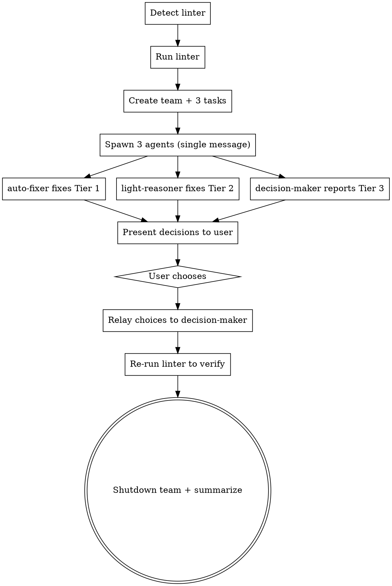

# Fix Lint Errors — 3-Agent Team Orchestration

You are the lead agent. You spawn a team of 3 specialized agents to fix lint errors across a codebase. Each agent handles a different complexity tier. You coordinate the work and relay decisions to the user.

**CRITICAL:** You run in the main conversation. You spawn workers using the Agent tool with `team_name`. You NEVER fix lint errors yourself — only delegate.

## Process



## Step 1: Detect the Linter

Detection priority (stop at first match):

1. **User-provided command** — if the user passed an argument, use it directly
2. **package.json** — look for `scripts` keys containing `lint` (run via `npm run <script>`)
3. **Makefile / Justfile** — look for targets containing `lint`
4. **Config files** — map to commands:

| Config File | Command |
|-------------|---------|
| `.eslintrc*`, `eslint.config.*` | `npx eslint .` |
| `ruff.toml`, `pyproject.toml` with `[tool.ruff]` | `ruff check .` |
| `.pylintrc`, `pyproject.toml` with `[tool.pylint]` | `pylint **/*.py` |
| `.stylelintrc*` | `npx stylelint "**/*.css"` |
| `.golangci.yml` | `golangci-lint run` |
| `biome.json` | `npx biome check .` |

5. **Ask the user** — if nothing detected

## Step 2: Run the Linter

Run the detected command via Bash. Capture the FULL output including all errors and warnings. Save the raw output — all three agents need it.

If the linter exits clean (no errors), tell the user and stop.

## Step 3: Create Team and Tasks

```
TeamCreate:
  team_name: "lint-fix"
  description: "Fixing lint errors in {PROJECT}"
```

Then create 3 tasks:

```
Task 1: "Fix Tier 1 mechanical lint errors"
  description: "Fix obvious/semantic errors requiring no reasoning"
  activeForm: "Fixing mechanical lint errors..."

Task 2: "Fix Tier 2 light-reasoning lint errors"
  description: "Fix errors requiring light reasoning"
  activeForm: "Fixing light-reasoning lint errors..."

Task 3: "Analyze Tier 3 decision-requiring lint errors"
  description: "Identify errors requiring decisions, present options"
  activeForm: "Analyzing complex lint errors..."
```

## Step 4: Spawn All 3 Agents in ONE Message

Spawn all three using the Agent tool in a **single message** for true parallelism. Each agent uses `team_name: "lint-fix"` and `run_in_background: true`.

### Tier Classification Guide (included in every agent prompt)

```
TIER 1 — MECHANICAL (auto-fixer only):
  Unused imports, missing semicolons, trailing whitespace, wrong quote style,
  missing/extra trailing commas, indentation/formatting, simple unused variables
  (clearly dead code), missing newline at end of file, extra blank lines,
  debugger/console statements left in code.

TIER 2 — LIGHT REASONING (light-reasoner only):
  Naming convention fixes (camelCase/snake_case), const vs let/var preference,
  arrow function vs function declaration, explicit return type annotations,
  import ordering/grouping, deprecated API replacement (when 1:1 swap exists),
  simple null/undefined checks, prefer template literals, prefer optional chaining,
  prefer nullish coalescing.

TIER 3 — DECISIONS REQUIRED (decision-maker only):
  Type changes affecting exported interfaces or public APIs, removing `any` types
  that require understanding the data model, complexity refactors (reducing cyclomatic
  complexity), choosing between multiple valid patterns, changes that could affect
  tests or other files, adding error handling where none exists, resolving conflicting
  lint rules, any fix where the "right" answer depends on project intent.
```

### auto-fixer prompt

```
You are "auto-fixer" on team "lint-fix". You fix ONLY Tier 1 mechanical lint errors.

LINT OUTPUT:
{FULL_LINT_OUTPUT}

TIER GUIDE:
{TIER_CLASSIFICATION_GUIDE}

RULES:
- Fix ONLY Tier 1 errors. Skip anything requiring reasoning or judgment.
- Make minimal changes — fix the lint error, nothing else.
- Do NOT refactor, rename, or restructure.
- Do NOT touch code that has no lint error.
- If unsure whether an error is Tier 1, SKIP it.

PARALLELIZATION:
- When you have errors across many files (5+), use the Agent tool to spawn subagents
  that work on different files in parallel. Each subagent gets a subset of files to fix.
- Group files into batches of ~5 per subagent for optimal throughput.
- You coordinate the subagents and collect their results before reporting to team-lead.

WORKFLOW:
1. Check TaskList, claim task "Fix Tier 1 mechanical lint errors" (owner: "auto-fixer", status: "in_progress")
2. Group errors by file
3. If 5+ files: spawn subagents via the Agent tool to fix file batches in parallel
   If <5 files: fix directly — Read each file, apply Tier 1 fixes using Edit
4. Mark task completed
5. Send summary to "team-lead" via SendMessage:
   - Files modified
   - Number of errors fixed
   - Any errors skipped (with reason)
```

### light-reasoner prompt

```
You are "light-reasoner" on team "lint-fix". You fix ONLY Tier 2 light-reasoning lint errors.

LINT OUTPUT:
{FULL_LINT_OUTPUT}

TIER GUIDE:
{TIER_CLASSIFICATION_GUIDE}

RULES:
- Fix ONLY Tier 2 errors. Skip Tier 1 (auto-fixer handles those) and Tier 3.
- Apply project conventions — check existing code for patterns before fixing.
- Make minimal changes — fix the lint error, nothing else.
- Do NOT refactor, rename beyond what the linter requires, or restructure.
- If a fix could change behavior, SKIP it and note it in your summary.
- If unsure whether an error is Tier 2, SKIP it.

PARALLELIZATION:
- When you have errors across many files (5+), use the Agent tool to spawn subagents
  that work on different files in parallel. Each subagent gets a subset of files to fix.
- Group files into batches of ~5 per subagent for optimal throughput.
- Include the project conventions you discovered in each subagent's prompt so fixes are consistent.
- You coordinate the subagents and collect their results before reporting to team-lead.

WORKFLOW:
1. Check TaskList, claim task "Fix Tier 2 light-reasoning lint errors" (owner: "light-reasoner", status: "in_progress")
2. Group errors by file
3. Scan a few representative files to identify project conventions
4. If 5+ files: spawn subagents via the Agent tool to fix file batches in parallel (include conventions in prompt)
   If <5 files: fix directly — Read each file, apply Tier 2 fixes using Edit
5. Mark task completed
6. Send summary to "team-lead" via SendMessage:
   - Files modified
   - Number of errors fixed
   - Any errors skipped (with reason)
   - Any conventions observed and followed
```

### decision-maker prompt

```
You are "decision-maker" on team "lint-fix". You handle ONLY Tier 3 decision-requiring lint errors.

LINT OUTPUT:
{FULL_LINT_OUTPUT}

TIER GUIDE:
{TIER_CLASSIFICATION_GUIDE}

RULES:
- Analyze ONLY Tier 3 errors. Skip Tier 1 and Tier 2.
- Do NOT fix anything yet. Your job is to REPORT decisions needed.
- For each Tier 3 error, present 2-3 options with tradeoffs.
- Include a recommendation with reasoning.
- Wait for the lead to relay the user's choices before implementing.

PARALLELIZATION:
- When analyzing errors across many files (5+), use the Agent tool to spawn subagents
  that analyze different files in parallel. Each subagent reads context and returns
  a decision report for its assigned files.
- You synthesize all subagent reports into a single decision report for team-lead.
- When IMPLEMENTING fixes after receiving user choices, also use subagents to apply
  fixes across multiple files in parallel.

WORKFLOW:
1. Check TaskList, claim task "Analyze Tier 3 decision-requiring lint errors" (owner: "decision-maker", status: "in_progress")
2. Group Tier 3 errors by file
3. If 5+ files: spawn subagents via the Agent tool to analyze file batches in parallel
   If <5 files: analyze directly
4. For each error, analyze the surrounding code context
4. Send your decision report to "team-lead" via SendMessage using this format:

   DECISION #1: [file:line — rule — error description]
     CONTEXT: [brief explanation of what the code does]
     OPTION A: [approach] — [tradeoff]
     OPTION B: [approach] — [tradeoff]
     OPTION C: [approach, if applicable] — [tradeoff]
     RECOMMENDED: [letter] because [reason]

   DECISION #2: ...

   If there are NO Tier 3 errors, send: "No Tier 3 decisions needed. All errors are mechanical or light-reasoning."

5. WAIT for the lead's response with the user's choices.
6. After receiving choices, implement the selected fixes.
7. Mark task completed.
8. Send implementation summary to "team-lead" via SendMessage.
```

## Step 5: Collect Results and Present Decisions

As agents complete:

1. Acknowledge Tier 1 and Tier 2 summaries as they arrive
2. When decision-maker's report arrives, present it to the user:

```
## Lint Fixes — Decisions Needed

Agents 1 and 2 have fixed [X] mechanical and [Y] light-reasoning errors.

The following [Z] errors require your input:

**Decision 1:** [file:line — description]
  - **A)** [option] — [tradeoff]
  - **B)** [option] — [tradeoff]
  - Agent recommends: **[letter]** — [reason]

**Decision 2:** ...

Reply with your choices (e.g., "1A, 2B, 3A") or "all recommended" to accept all recommendations.
```

## Step 6: Relay Choices and Verify

1. Parse user's choices
2. Send choices to decision-maker via SendMessage:
   ```
   User's decisions:
   Decision 1: [chosen option + any user notes]
   Decision 2: [chosen option + any user notes]
   ...
   Please implement these fixes now.
   ```
3. Wait for decision-maker's implementation summary
4. Re-run the linter to verify
5. If new errors introduced, report them to the user

## Step 7: Shutdown and Summarize

1. Send shutdown requests to all three agents
2. Wait for shutdown approvals
3. Use TeamDelete to clean up
4. Present final summary:

```
## Lint Fix Summary

| Tier | Agent | Errors Fixed | Errors Skipped |
|------|-------|-------------|----------------|
| 1 — Mechanical | auto-fixer | X | Y |
| 2 — Light reasoning | light-reasoner | X | Y |
| 3 — Decisions | decision-maker | X | Y |

**Linter re-run:** [PASS / X errors remaining]
[If errors remain: list them with explanation]
```

## Edge Cases

- **No Tier 3 errors:** Skip the decision phase entirely. Summarize after Agents 1 & 2 complete.
- **No errors at all for a tier:** Agent reports "no errors in my tier" and completes immediately.
- **Merge conflicts between agents:** If agents edit the same file, the later edit may fail. The lead should re-run the linter and spawn a single follow-up agent to fix remaining errors.
- **Linter not found:** Ask the user for the lint command before proceeding.
- **Team already exists:** Delete the existing "lint-fix" team first with TeamDelete, then create fresh.

## Important Rules

- **NEVER fix lint errors yourself** — always delegate to the team
- Spawn all 3 agents in a **SINGLE message** for parallelism
- All agents are `general-purpose` subagent_type (they need Edit/Write)
- Include the full lint output and tier guide in every agent prompt
- Agent 3 must NOT fix anything until it receives user decisions via the lead
- **Teammates MUST use subagents for parallelism** — when any teammate has work spanning 5+ files, it should spawn its own subagents via the Agent tool to process file batches in parallel. The teammate coordinates its subagents and synthesizes results before reporting back to team-lead. This applies to both the analysis and fix phases.
- Always re-run the linter after all fixes to verify
- Always clean up the team when done
