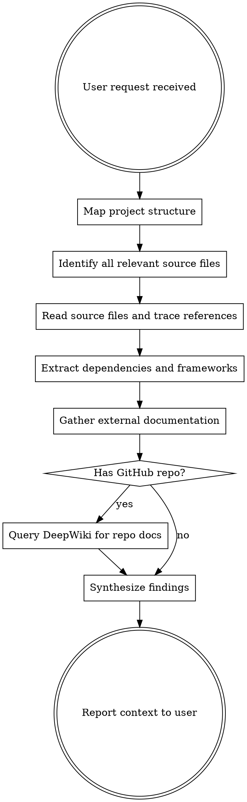

# Project Exploration

## Overview

Exhaustive context gathering before action. Read everything that could be relevant. Trace every dependency, comment, URL, and document. Optimize for accuracy and completeness, not token efficiency.

## When to Use

- Starting work in an unfamiliar codebase
- User asks how something works
- Before implementing any feature or fix
- When a request involves libraries, frameworks, or external systems
- When comments reference papers, tickets, or URLs

## When NOT to Use

- You already have full context from prior exploration in this conversation
- User explicitly asks for a quick/shallow answer
- The question is about general knowledge, not this codebase

## Core Principle

**Leave no stone unturned.** If something MIGHT be relevant, investigate it. A missed dependency or undiscovered config file costs more than the tokens spent reading it.

## Exploration Process



## Phase 1: Map the Project

1. **List the full directory tree** — understand the project layout before reading anything
2. **Read manifest files first** — `package.json`, `pyproject.toml`, `Cargo.toml`, `CMakeLists.txt`, `requirements.txt`, `go.mod`, `Gemfile`, `pom.xml`, `.csproj` — these reveal every dependency
3. **Read config files** — `.env.example`, `tsconfig.json`, `webpack.config.*`, `docker-compose.yml`, `Makefile`, `.github/workflows/*` — these reveal how the project runs
4. **Read documentation** — `README.md`, `CONTRIBUTING.md`, `docs/`, `CHANGELOG.md`, `AGENTS.md`, `AGENTS.md` — these reveal intent and architecture
5. **Read ALL non-code artifacts** — LaTeX papers (`*.tex`), research notes, design documents, architecture decision records, Jupyter notebooks (`*.ipynb`), Obsidian vaults, wiki directories. **These are often MORE valuable than source code** — they contain formal proofs, design rationale, convergence guarantees, and planned features that exist nowhere in the code
6. **Check for monorepo structure** — `workspaces`, `packages/`, `apps/`, `libs/` — each sub-project may have its own manifests

**Use Codex-context `search_code` for semantic search if the codebase is indexed.** If not indexed and the codebase is large (50+ files), index it first with `index_codebase`.

## Phase 2: Read and Trace

For every file relevant to the user's request:

1. **Read the full file** — do not skim or read partial files
2. **Trace imports** — follow every import/require/include to its source; read those files too
3. **Trace comments** — look for:
   - URLs (GitHub issues, docs, Stack Overflow, papers)
   - TODO/FIXME/HACK/NOTE annotations
   - References to other files, modules, or systems
   - Academic paper citations (DOIs, arXiv IDs, author names)
4. **Trace type definitions** — follow type imports to their declaration files
5. **Trace configuration references** — if code reads `process.env.X` or `config.Y`, find where those are defined
6. **Trace test files** — tests often reveal expected behavior and edge cases; find and read corresponding test files

**Do not stop at the first layer.** If file A imports B which imports C, and C is relevant, read C.

## Phase 3: Gather External Documentation

For every dependency, framework, or library identified in Phase 1-2:

### Priority 1: docs-mcp-server (local indexed docs)

```
search_docs(library: "react", query: "useEffect cleanup")
```

- Search first — docs may already be indexed
- If not indexed but critical to the task, use `scrape_docs` to index the library's documentation URL
- Check `list_libraries` to see what's already available

### Priority 2: Context7 (up-to-date library docs)

```
resolve-library-id(libraryName: "express", query: "middleware error handling")
→ then query-docs(libraryId: "/expressjs/express", query: "middleware error handling")
```

- Use for any library/framework where you need API details, usage patterns, or configuration options
- Always resolve the library ID first

### Priority 3: DeepWiki (GitHub repo documentation)

```
read_wiki_structure(repoName: "owner/repo")
ask_question(repoName: "owner/repo", question: "How does X work?")
```

- Use when the project depends on a specific GitHub repo
- Use when the project IS a GitHub repo and may have wiki documentation

### Priority 4: Exa web search (broad internet search)

```
web_search_exa(query: "sliding mode control CSTR reactor tutorial", numResults: 8)
```

- Use when docs-mcp-server and Context7 don't have what you need
- Use for academic concepts, domain-specific knowledge, or niche libraries
- Use for finding papers, tutorials, or blog posts referenced in comments

### Priority 5: WebSearch (current events, recent releases)

- Use for very recent information (last few months)
- Use when Exa results are insufficient

**You MUST attempt at least Priority 1 and Priority 2 for every significant dependency.** Do not skip documentation lookup because you think you know the library. Your training data may be outdated.

## Phase 4: Synthesize

Before responding to the user:

1. **Cross-reference** — do the docs match the code? Flag any discrepancies
2. **Identify gaps** — what couldn't you find? Be explicit about unknowns
3. **Map the dependency graph** — which components depend on which?
4. **Note version constraints** — are there pinned versions that matter?

## What to Investigate (Exhaustive Checklist)

| Category | Look For |
|----------|----------|
| **Source code** | All files matching the request topic; imports chain; type definitions |
| **Tests** | Unit tests, integration tests, e2e tests for the relevant code |
| **Config** | Environment variables, build configs, CI/CD pipelines |
| **Dependencies** | Every package in manifests; their docs and changelogs |
| **Comments** | URLs, TODOs, FIXMEs, paper citations, ticket references |
| **Git history** | Recent commits touching relevant files (`git log --oneline -20 -- path`) |
| **Documentation** | README, docs/, wiki, inline JSDoc/docstrings, architecture decision records |
| **External refs** | Papers, RFCs, specs, API docs for external services |
| **Related code** | Similar patterns elsewhere in the codebase; shared utilities |
| **Database/schemas** | Migration files, schema definitions, ORM models |
| **Research artifacts** | LaTeX papers, Jupyter notebooks, Obsidian vaults, design docs, proofs, theorems |

## Red Flags — You're Cutting Corners

| Thought | Reality |
|---------|---------|
| "I know this library well enough" | Your training data may be stale. Check docs. |
| "This file probably isn't relevant" | Read it. You don't know until you look. |
| "I'll save tokens by skipping the tests" | Tests reveal behavior the source doesn't. Read them. |
| "The README is probably outdated" | Read it anyway — even outdated docs reveal intent. |
| "I don't need to trace that import" | You do. Trace every import relevant to the request. |
| "Web search is overkill for this" | If a comment references a paper or concept, search for it. |
| "I already have enough context" | Have you checked docs for EVERY dependency involved? |
| "This is just a config file" | Config files reveal architecture, deployment, and constraints. |

## Common Mistakes

1. **Reading only the file the user mentioned** — always trace outward from the focal point
2. **Skipping documentation lookup** — even for "well-known" libraries, check current docs
3. **Ignoring comments and TODOs** — these often contain critical context the code doesn't express
4. **Not reading test files** — tests are executable documentation of expected behavior
5. **Stopping at one layer of imports** — follow the chain until you reach external packages or dead ends
6. **Not checking git history** — recent commits on relevant files reveal what changed and why
